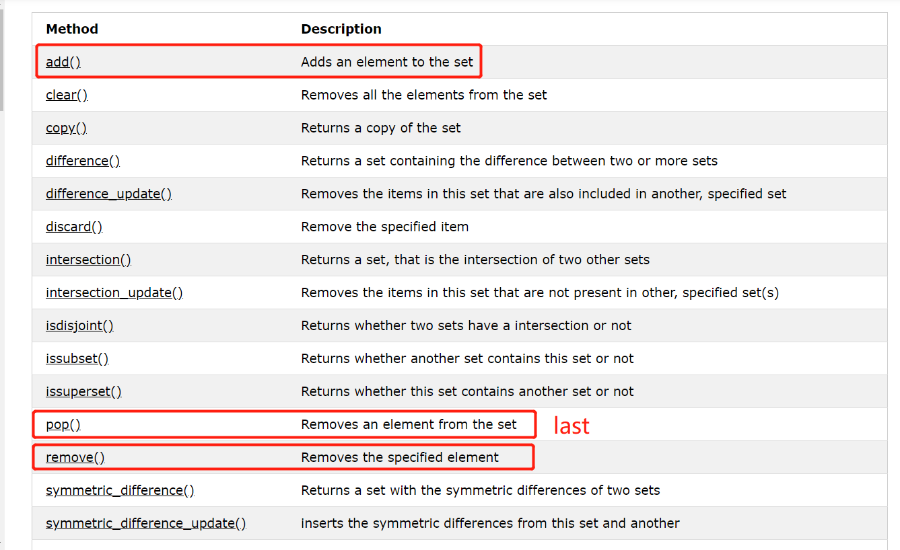

## Structure

### List

[]


### Tuple

type()  len() , indexing  ()


### Set

{}




### Dictionary


### String 

#### format

The `format()` method allows you to format selected parts of a string,is a method of string,think it as a regex,to control such values, add placeholders (curly brackets `{}`) in the text, and run the values through the `format()` method:

```python
age = 36
name = "John"
txt = "His name is {1}. {1} is {0} years old."
print(txt.format(age, name))
```

can assign format (similar to function,take it as function parameter)

```python
myorder = "I have a {carname}, it is a {model}."
print(myorder.format(carname = "Ford", model = "Mustang"))
```

https://www.w3schools.com/python/python_ref_string.asp

## Function

#### built-in function

https://www.w3schools.com/python/python_ref_functions.asp

#### Arbitrary Arguments, *args

If you do not know how many arguments that will be passed into your function, add a `*` before the parameter name in the function definition.

This way the function will receive a *tuple* of arguments, and can access the items accordingly:

```python
def my_function(*kids):
  print("The youngest child is " + kids[2])

my_function("Emil", "Tobias", "Linus")
```

#### Arbitrary Keyword Arguments, **kwargs

If you do not know how many keyword arguments that will be passed into your function, add two asterisk: `**` before the parameter name in the function definition.

This way the function will **receive a *dictionary* of arguments**, and can access the items accordingly:

```python
def my_function(**kid):
  print("His last name is " + kid["lname"])

my_function(fname = "Tobias", lname = "Refsnes")
```

#### Default Parameter Value

The following example shows how to use a default parameter value.

If we call the function without argument, it uses the default value:

```python
def my_function(country = "Norway"):
  print("I am from " + country)

my_function("Sweden")
my_function("India")
my_function()
my_function("Brazil")
```

## Class

#### The self Parameter-必须指定，但不是关键词

The `self` parameter is a reference to the current instance of the class, and is used to access variables that belongs to the class.

It does not have to be named `self` , you can call it whatever you like, but it has to be the first parameter of any function in the class:

#### Use the super() Function for inherience

```python
class Student(Person):
  def __init__(self, fname, lname):
    super().__init__(fname, lname)
```

#### iterators

n Python, an iterator is an object which implements the iterator protocol, which consist of the methods `__iter__()` and `__next__()`.

The `__iter__()` method acts similar, you can do operations (initializing etc.), but must always return the iterator object itself.

The `__next__()` method also allows you to do operations, and must return the next item in the sequence.

All these objects have a `iter()` method which is used to get an iterator:

iters have  next function  : next(myit)

##### stopiteration:

In the `__next__()` method, we can add a terminating condition to raise an error if the iteration is done a specified number of times:

```python
class MyNumbers:
  def __iter__(self):
    self.a = 1
    return self

  def __next__(self):
    if self.a <= 20:
      x = self.a
      self.a += 1
      return x
    else:
      raise StopIteration

myclass = MyNumbers()
myiter = iter(myclass)

for x in myiter:
  print(x)
```

#### Global Keyword

 use the `global` keyword if you want to make a change to a global variable inside a function.

```python
x = 300

def myfunc():
  global x
  x = 200

myfunc()

print(x)
```

## Module

A file is a module ,can use `import` to import the actual module,can cite variable but using `.`;

### Datetime

The `datetime` module has many methods to return information about the date object.`datetime.datetime` is the object that returned

```python
import datetime

x = datetime.datetime.now()

print(x.year)
print(x.strftime("%A"))
```

https://www.w3schools.com/python/python_datetime.asp

### JSON

```python
# convert into JSON:
y = json.dumps(x)
	# Format the Result
    json.dumps(x, indent=4)
    
# parse x:
y = json.loads(x)
```

### Numpy

https://datacamp-community-prod.s3.amazonaws.com/e9f83f72-a81b-42c7-af44-4e35b48b20b7

`reshape` return a VIEW,Pass `-1` as the value, and NumPy will calculate this number to have one "unknown" dimension.(该维度自动设定)，因此`reshape(-1)`就是变成原先的矩阵

`nditer`是一个更强大的iterator，

##### Iterating Array With Different Data Types

We can use `op_dtypes` argument and pass it the expected datatype to change the datatype of elements while iterating.

```python
for x in np.nditer(arr[:, ::2]):
  print(x)
```

##### Enumerated Iteration Using ndenumerate()

Enumeration means mentioning sequence number of somethings one by one.

Sometimes we require corresponding index of the element while iterating, the `ndenumerate()` method can be used for those usecases.

```python
arr = np.array([1, 2, 3])

for idx, x in np.ndenumerate(arr):
  print(idx, x)
```

##### Joining NumPy Arrays

We pass a sequence of arrays that we want to join to the `concatenate()` function, along with the axis. If axis is not explicitly passed, it is taken as 0.

##### Joining Arrays Using Stack Functions

`hstack()` to stack along rows.

`vstack() ` to stack along columns.	

##### Splitting NumPy Arrays

We use `array_split()` for splitting arrays, we pass it the array we want to split and the number of splits.The return value of the `array_split()` method is an array containing each of the split as an array.

```python
newarr = np.array_split(arr, 3, axis=1)
```

using `hsplit()` opposite of `hstack()`,这个操作会把stack split 成很多最小组成份

##### Searching Arrays

To search an array, use the `where()` method.

```python
# Find the indexes where the value is 4:
arr = np.array([1, 2, 3, 4, 5, 4, 4])
x = np.where(arr == 4)
print(x)
# The example above will return a tuple: (array([3, 5, 6],)
```

##### Search Sorted

https://www.w3schools.com/python/numpy_array_search.asp

There is a method called `searchsorted()` which performs a binary search in the array, and **returns the index where the specified value would be inserted to maintain the search order.**

- The `searchsorted()` method is assumed to be used on sorted arrays.
- can find multiple place

```python
arr = np.array([1, 3, 5, 7])
x = np.searchsorted(arr, [2, 4, 6])
print(x)
```

##### Sorting Arrays

`arr = np.sort(arr)`

##### Filtering Arrays

Getting some elements out of an existing array and creating a new array out of them is called *filtering*.

In NumPy, you filter an array using a *boolean index list*.

```python
arr = np.array([41, 42, 43, 44])
filter_arr = arr > 42
# quick way to filter
```

#### Numpy Random

https://www.w3schools.com/python/numpy_random.asp

```python
x = random.randint(100)  # one element
x=random.randint(100, size=(5))  # several element
```

##### Generate Random Number From Array

The `choice()` method allows you to generate a random value based on an array of values.It takes an array as a parameter and randomly returns one of the values.

- can also return an array Add a `size` parameter to specify the shape of the array.

- ```python
  x = random.choice([3, 5, 7, 9], size=(3, 5)
  ```

#### ufuncs

矩阵，线代作用函数

ufuncs are used to implement *vectorization* in NumPy which is way faster than iterating over elements.

They also provide broadcasting and additional methods like reduce, accumulate etc. that are very helpful for computation.

ufuncs also take additional arguments, like:

`where` boolean array or condition defining where the operations should take place.

`dtype` defining the return type of elements.

`out` output array where the return value should be copied.

## Exception

normal way:

```python
try:
  print(x)
except NameError:
  print("Variable x is not defined")
except:
  print("Something else went wrong")
```

#### raise exception

To throw (or raise) an exception, use the `raise` keyword.

```python
x = -1

if x < 0:
  raise Exception("Sorry, no numbers below zero")
```


## I/O

#### user input

```python
username = input("Enter username:")
print("Username is: " + username)
```

#### file handling - open

The key function for working with files in Python is the `open()` function.

The `open()` function takes two parameters; *filename*, and *mode*.

There are four different methods (modes) for opening a file:

> `"r"` - Read - Default value. Opens a file for reading, error if the file does not exist
>
> `"a"` - Append - Opens a file for appending, creates the file if it does not exist
>
> `"w"` - Write - Opens a file for writing, creates the file if it does not exist
>
> `"x"` - Create - Creates the specified file, returns an error if the file exists

In addition you can specify if the file should be handled as binary or text mode

> `"t"` - Text - Default value. Text mode
>
> `"b"` - Binary - Binary mode (e.g. images)

- `read()` method for reading the content of the file,By default the `read()` method returns the whole text, but you can also specify how many characters you want to return.

```python
f = open("demofile.txt", "r")
print(f.read(5)) #  f is an object that have method for later operation
```

- To delete a file, you must import the OS module, and run its `os.remove()` function:

  - ```PYTHON
    import os
    if os.path.exists("demofile.txt"):
      os.remove("demofile.txt")
    else:
      print("The file does not exist")
    ```

  - ```python
    import os
    os.rmdir("myfolder") # remove the whole folder
    ```


## 